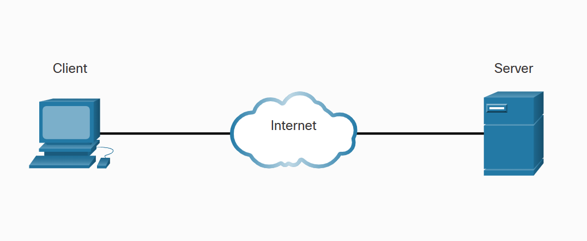
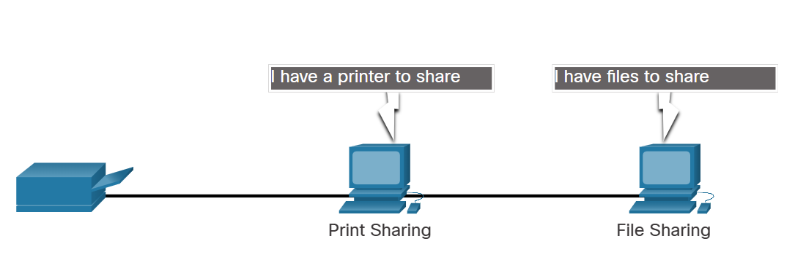

# Client and Server

All computers connected to a network that participate directly in network communication are classified as hosts. Hosts can send and receive messages on the network. In modern networks, computer hosts can act as a client, a server, or both, as shown in the figure. The software installed on the computer determines which role the computer plays.

Servers are hosts that have software installed which enable them to provide information, like email or web pages, to other hosts on the network. Each service requires separate server software. For example, a host requires web server software in order to provide web services to the network. Every destination that you visit online is provided to you by a server located somewhere on a network that is connected to the global internet.

Clients are computer hosts that have software installed that enables the hosts to request and display the information obtained from the server. An example of client software is a web browser, such as Internet Explorer, Safari, Mozilla Firefox, or Chrome.

- **Client**: makes requests.
- **Server**: as server respond to requests.

---

# Peer-to-Peer Networks

Client and server software usually run on separate computers, but it is also possible for one computer to run both client and server software at the same time. In small businesses and homes, many computers function as the servers and clients on the network. This type of network is called a peer-to-peer (P2P) network.

The simplest P2P network consists of two directly connected computers using either a wired or wireless connection. Both computers are then able to use this simple network to exchange data and services with each other, acting as either a client or a server as necessary.

Multiple PCs can also be connected to create a larger P2P network, but this requires a network device, such as a switch, to interconnect the computers.

The main disadvantage of a P2P environment is that the performance of a host can be slowed down if it is acting as both a client and a server at the same time. The figure lists some of the advantages and disadvantages of peer-to-peer networks.

In larger businesses, because of the potential for high amounts of network traffic, it is often necessary to have dedicated servers to support the number of service requests.

The advantages and disadvantages of P2P networking are summarized in the figure.

The advantages of peer-to-peer networking:

- Easy to set up
- Less complex
- Lower cost because network devices and dedicated servers may not be required
- Can be used for simple tasks such as transferring files and sharing printers

The disadvantages of peer-to-peer networking:

- No centralized administration
- Not as secure
- Not scalable
- All devices may act as both clients and servers which can slow their performance

---

