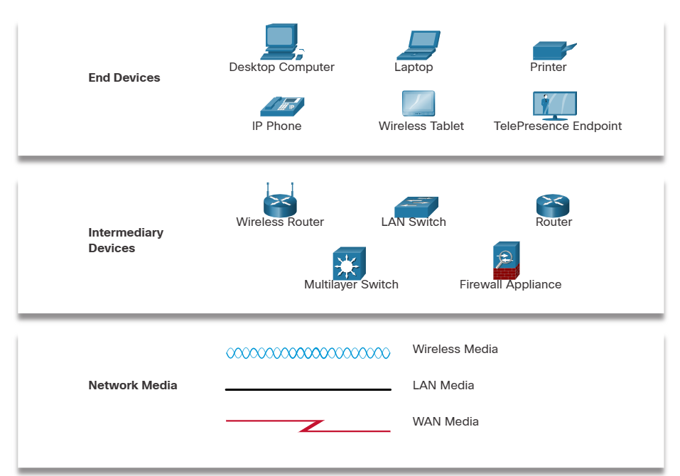

# Network Infrastructure

The network infrastructure contains three categories of hardware components, as shown in the figure:

- End devices
- Intermediate devices
- Network media

Devices and media are the physical elements, or hardware, of the network. Hardware is often the visible components of the network platform such as a laptop, PC, switch, router, wireless access point, or the cabling used to connect the devices. Occasionally, some components may not be so visible. In the case of wireless media, messages are transmitted through the air using invisible radio frequencies or infrared waves.

## End Devices

The network devices that people are most familiar with are called end devices, or hosts. These devices form the interface between users and the underlying communication network.

Some examples of end devices are as follows:

- Computers (workstations, laptops, file servers, web servers)
- Network printers
- Telephones and teleconferencing equipment
- Security cameras
- Mobile devices (such as smart phones, tablets, PDAs, and wireless debit/credit card readers and barcode scanners)