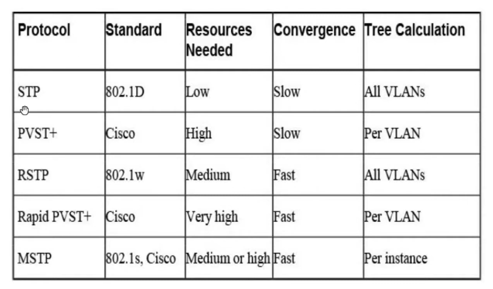
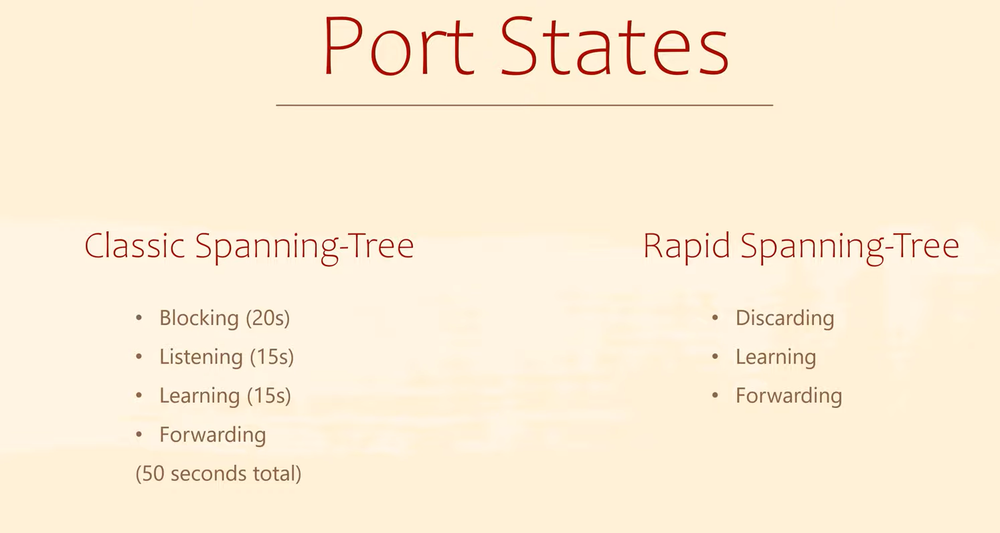

# STP (Spanning Tree Protocol)

STP: Helps prevents "Broadcast Storm" and other problems that could occur in a redundant switched network.

Three classes of problems caused by not using STP in redundant LANs.

| Problem                     | Description                                                  |
| --------------------------- | ------------------------------------------------------------ |
| Broadcast Storms            | The forwarding of a frame repeatedly on the same link, consuming significant parts of the links capacities. |
| MAC table instability       | The continual updating of a switch's MAC address table with incorrect entries, in reaction to looping frames, resulting in frames being sent to the wrong locations. |
| Multiple frame transmission | A side effect of looping frames i which multiple copies of one frame are delivered to the intended host, confusing the host. |

---

## Bridge Protocol Data Unit (BPUD): 

A multicast frame contains STP configurations (By default, switches exchange BPDUs every 2s). One piece of information included in the BPDU is the bridge ID (BID).

## Bridge ID (BID):

A combination of **Priority Value & MAC Address** that uniquely identified each switch. The default priority is 32768.
Example of BID: {32768 - 0002.4A7C.4BC4}

**Root Port & Designated Port**: Forwarding State

**Alternate Port**: Blocking State.

---

## How STP Works

1. **Elect a root bridge (RB)**: The switch with the lowest **BID** (1- Priority, 2- MAC address).
2. **Elect a root port for each switch except the RB**: The port that has the lowest cost path to the root bridge (Highest Bandwidth & Lowest number of links)
   - If a switch has multiple equal cost paths to the **RB**, it will select the path with the lowest neighbor's **BID**.
   - If it is connected directly to the **RB** or has multiple links connected to that neighbor, it will select the lowest Port ID (Example of Port ID: Fa0/1).
3. **All the ports that are opposite the root ports and all the root bridge's ports will be designated ports**.
4. **Elect a designated port for each remaining link**: The switch that has the lowest cost path to the root bridge.
   - If both switches have the same cost path, it will select the switch with lowest BID.
5. **All the other ports will be alternate ports (Blocking state).**

---

## How to change priority of switch

```sh
Switch(config)#spanning-tree vlan 1 priority 4096
```

---

# STP Types

1. ## STP (Spanning Tree Protocol):

   - The original specification of STP.
   - Developed by IEEE.
   - Defined in 802.1D.
   - Slow.
   - Provides a spanning tree instance for all VLANs.

2. ## RSTP (Rapid Spanning Tree Protocol):

   - An evolution of STP.
   - Developed by IEEE.
   - Defined in 802.1W.
   - Fast
   - Provides a spanning tree instance for all VLANs.

3. ## PVST+ (Per-VLAN Spanning Tree Plus):

   - Based on STP 802.1D.
   - Developed by Cisco.
   - Used by default on Cisco Switches.
   - Slow.
   - Provides a spanning tree instance for each configured VLAN.

4. ## RPVST+ (Rapid Per-VLAN Spanning Tree Plus)

   - Based on RSTP 802.1W.
   - Developed by Cisco.
   - Fast.
   - Provides a spanning tree instance for each configured VLAN.

5. ## MSTP (Multiple Spanning Tree Protocol):

   - Developed by Cisco and IEEE, defined in 802.1S.
   - Fast.
   - Provides a spanning tree instance for group of VLANs.





Change Switch mode:

```sh
Switch(config)#spanning-tree mode ?
  pvst        Per-Vlan spanning tree mode
  rapid-pvst  Per-Vlan rapid spanning tree mode
```

```sh
Switch(config)#spanning-tree mode rapid-pvst 
```

---

## PortFast & BPDU Guard

**PortFast**: Used for end-hosts to speed STP process. After PortFast is configured, the port immediately transitions from the blocking state to the forwarding state.

**BPDU Guard**: Used to avoid forming loop from an invalid PortFast configuration. If BPDU message is received, the port will be shut down. BPDU indicates that another switch is connected to the port.

to make it for all access ports: 

```sh
Switch(config)#spanning-tree portfast default 
```

or

```sh
Switch(config)#int fa0/3
Switch(config-if)#sw mode access 
Switch(config-if)#spanning-tree portfast
```

```sh
Switch(config-if)#spanning-tree bpduguard enable 
```

---

## Primary & Secondary Root

how to set primary root 

```sh
Switch(config)#spanning-tree vlan 1 root primary 
```

how to set secondary root

```sh
Switch(config)#spanning-tree vlan 1 root secondary 
```

---

