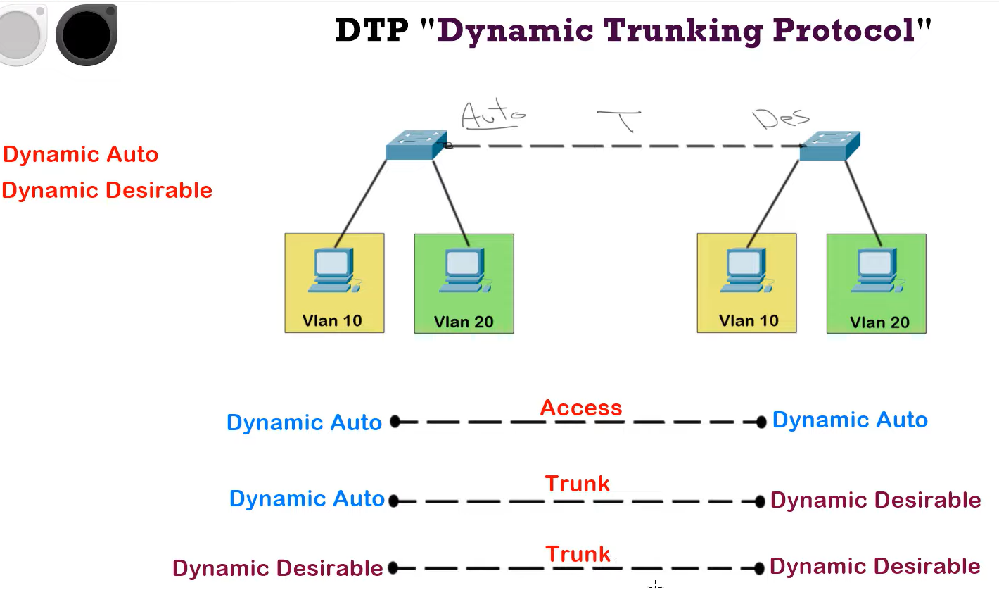
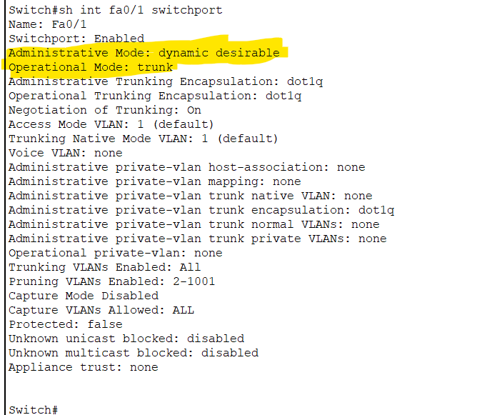
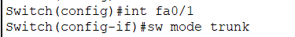
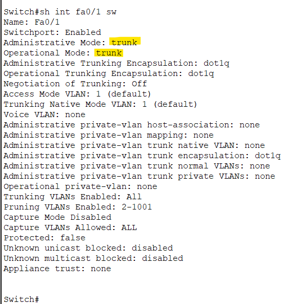

# Dynamic Trunking Protocol

DTP is a Cisco proprietary protocol used for automatic negotiation of trunking (VLAN information) between switches in a network, allowing them to dynamically determine whether a link should operate as an access link or a trunk link.

This protocol has two modes:

1. Dynamic Auto.
2. Dynamic Desirable.



How to change switch mode:

```sh
Switch(config-if)#switchport mode dynamic desirable 
```

to see that:

```sh
Switch#sh int fa0/1 switchport 
```



Note: The port of switch by default is in **operation mode access** and in **switch mode dynamic auto**.

How to disable DTP:

before:


config:




after:

