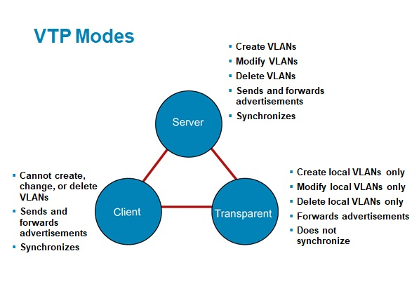

# VLAN Trunking Protocol

VTP is a Cisco protocol that automates the management of VLAN configurations across interconnected switches in a network, ensuring consistency in VLAN setups.

## VTP Modes:



## configuration Revision Number:

32-bit number that indicates the level of revision for VTP packet.

- Every time one modification is done on the VLANs by the server switch, and the configuration increases by one.

## VTP Messages:

- Summary Advertisement: to inform switches in the network abut changes in VLAN configurations. (send from server).
- Subset Advertisement: convey specific changes or updates to VLAN configurations within a subset of switches in a network. (send from server).
- Request Advertisement: (send from client).

---

## VTP Domain

A VTP domain is a logical grouping of interconnected Cisco witches that share and synchronize VLAN information. It ensures consistency in VLAN configurations among switches within the same domain.

---

## Configuration:

set domain name:

```sh
Switch(config)#vtp domain test.com
```

set domain password:

```sh
Switch(config)#vtp password root5
```

change VTP mode:

```sh
Switch(config)#vtp mode server
or
Switch(config)#vtp mode client 
or
Switch(config)#vtp mode transparent 
```

to VTP status:

```sh
Switch#sh vtp status
```

