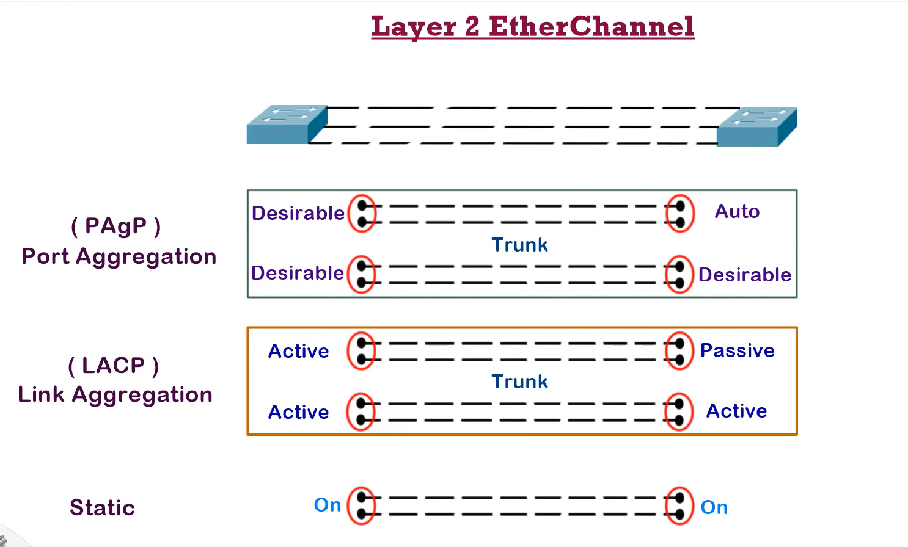
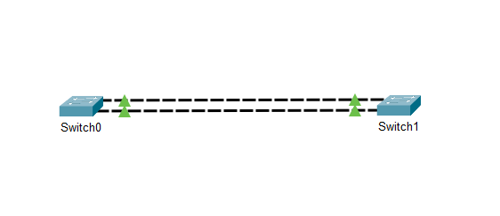
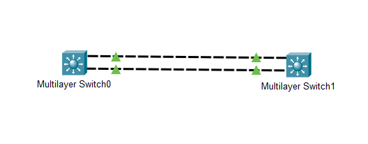

# Etherchannel

The Etherchannel technology is generally used to provide fault tolerance and increase bandwidth. 

When an Etherchannel is created, the STP no longer sees it as multiple ports but rather as a single port.

## Requirements:

Etherchannel configuration requires certain features to be same.

- **Speed and duplex**: The ports on the switches that will participate in the Etherchannel must have the same spped and duplex settings on both sides.
- **Mode**: the ports on the switches participating in Etherchannel must be in either access or trunk mode on both sides.
- **Native VLAN**: The Native VLAN is the VLAN assigned to a "Trunk" connection point. A "Trunk" connection point supports untagged traffic (Traffic without any VLAN tag) as well as tagged traffic created by multiple VLANs. 
- **VLAN Matching**: All ports within the Ehterchannel group must either be assigned to the same VLAN or configured as trunk.

---

## EtherChannel Configuration

There are two types of negotiation protocols are used for automatic link configuration between two switches.

1. ### PagP (Port Aggregation Protocol):

   - Developed by Cisco.
   - There are two modes to agree on PagP: **Desirable** and **Auto**.
   - In **Desirable** mode, the local switch sends an Etherachannel configuration request to the remote switch.
   - In **Auto**, the local switch waits for an Etherchannel configuration request from the opposite switch.

2. ## LACP (Link Aggregation Control Protocol):

   - Developed by IEEE 802.3ad standart.
   - There are two modes for switches to agree on LACP: **Active** and **Passive**.
   - In Active mode, the local switch sends an EtherChannel configuration request to the remote switch.
   - In Passive mode, the local switch waits for an EtherChannel configuration request from the opposite switch.

3. ## Static EtherChannel:

   - A protocol isn't used to determine if an Ethercannel should be vound.
   - Interfaces are statically cinfigured to from an Etherchannel



---

## Example using PagP:

This commands we will use it for the two switches.

```sh
Switch(config)#int range f0/1-2
Switch(config-if-range)#shutdown
Switch(config-if-range)#channel-group 1 mode desirable 
Switch(config-if-range)#no shutdown 
Switch(config)#int port-channel 1
Switch(config-if)#sw mode trunk
```



If we have another versions of switches:

```sh
Switch(config)#int range f0/1-2
Switch(config-if-range)#shutdown 
Switch(config-if-range)#channel-group 1 mode desirable 

Switch(config)#int range f0/1-2
Switch(config-if-range)#no shutdown 

Switch(config-if)#switchport trunk encapsulation dot1q 

Switch(config-if)#switchport trunk encapsulation dot1q 
```



---

## Example using LACP:

```sh
Switch(config)#int range f0/1-2
Switch(config-if-range)#shutdown 
Switch(config-if-range)#channel-group 1 mode active

Switch(config-if-range)#exit
Switch(config)#int por
Switch(config)#int port-channel 1
Switch(config-if)#sw mode trunk
```

---

## Example using Static:

```sh
s1(config)#int range f0/1-2
s1(config-if-range)#shutdown 

s1(config-if-range)#channel-group 1 mode on

s1(config-if-range)#exit
s1(config)#int range f0/1-2
s1(config-if-range)#no shutdown 

s1(config)#int port-channel 1
s1(config-if)#sw mode trunk
```


