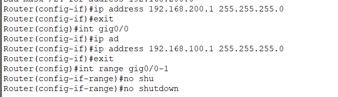
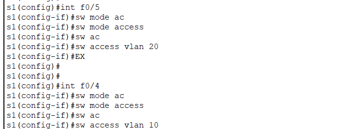
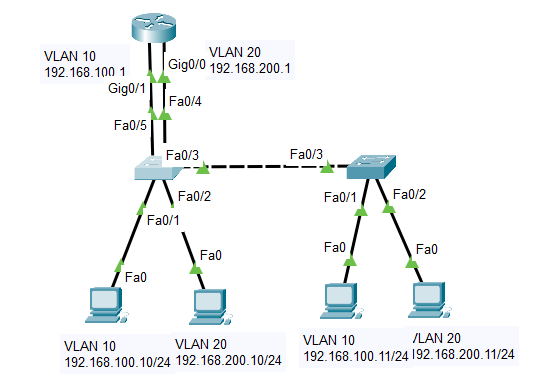
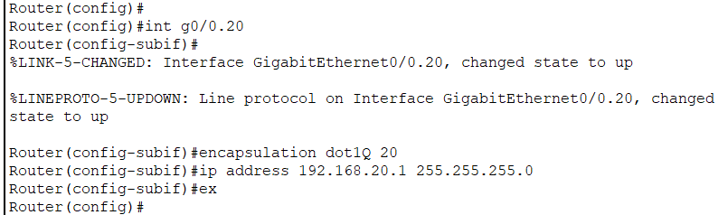
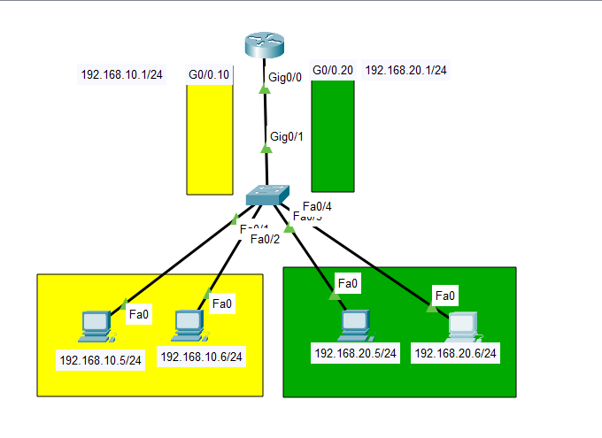

# Inter-VLAN Routing

Allows devices from different VLANs to communicate to each other.

## Inter-VLAN Routing Options:

1. Traditional Inter-VLAN Routing: Each VLAN need a physical interface on a router (as a default gateway).
   - Typically not used.
   - Requires lots of physical interfaces.
2. Router-on-a-stick (ROAS).
3. Multilayer switch.

---

1. ## Traditional Inter-VLAN Routing

   Each VLAN need a physical interface on a router (as a default gateway).

   ### Steps:

   1. **Configure Switch and pc IP addresses**: we configure switch and its's VLAN and access/trunk links and we put IP addresses to PCs.
   2. **Router Configure**: We set IP addresses for VLANs in router.
   3. **Default Gateway**: we put default gateway in PCs.

---

2. ## Router-on-a-Stick (ROAS)

   ## Steps:

   1. We configure switch and its VLANs and linking them with PCs.
   2. We put the port which linked with the router as **Trunk**.
   3. We create **Sub-Interfaces**:
      - create sub-interface
      - encapsulate it as dot1Q with VLAN
      - put IP address to it.

    

