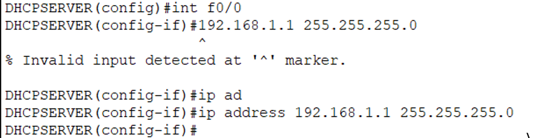
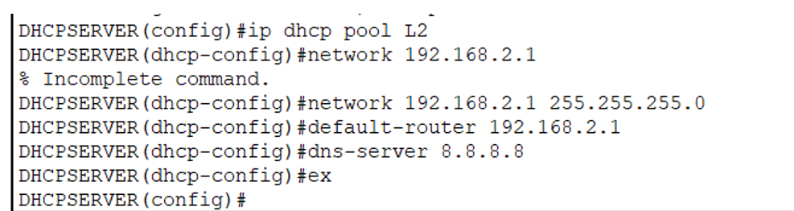

# Dynamic Host Configuration Protocol (DHCP)

There are two methods to assign IP addresses:

1. **Statically (Manual Configuration)**: by a network administrator.
   - Typically intermediary devices (such as routers), servers and printers are configured manually as their IP addresses should be fixed.
2. **Dynamically (Automatic Configuration)**: by DHCP server.
   - PCs usually get their network configuration from a DHCP server.

---

## DHCP

Automatically assigned IP addresses and other network configuration (such as subnet mask, default gateway, DNS server ...etc) to hosts in a network.

- DHCP leases IP addresses for a period of time (When a DHCP lease expires, the client need to renew its IP address).
- DHCP can be **dedicated server** (Windows, Linux) or a **router** acts as DHCP server.
- DHCP server port: 67, DHCP client port: 68 (UDP).

---

## DORA (Discover Offer Request Acknowledgement)


---

## DHCP Router

1. **Router Configure for fa0/0:**



2. **Router Configure for fa0/1:**


### Exclude some IP addresses:


- NOTE: we should always exclude default IP address.

**Now we will create the first and second DHCP pool:**




- NOTE: adding dns-server is optional.

## To see all info about DHCP:

```sh
DHCP_SVR#sh ip dhcp binding 

DHCP_SVR#sh ip dhcp pool
```


---


