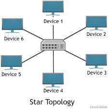

# Network & Internet

- **Computer Network**: A collection of devices interconnected together to exchange information. ==> Interconnected through: wires or wireless.
- **Internet**: Network of networks --> largest network.
- **Data Communication**: are the exchange of data between two nodes via some form of link such as cable.
- **Protocol**: a set of rules that govern data communication.
- **Host**: Every computer on the network is a host.
- **Client**: makes requests.
- **Server**: as server respond to requests.

## Uses of Computer Network:

1. **Resource Sharing** (data, info, etc):
   Client: machine that requests resource / service.
   Server: machine that provides the requested resource / server.
2. **Communication**: (e-mail, video, ...)
3. **Electronic Commerce**: (e-commerce)
4. **Financial Services**: (Bank)
5. **Mobile / Wireless Computing**: (Hotspot)

## Types of Transmission Technology:

1. **Broadcasting**: Data is sent from one source to all devices within the network.
   (one-to-all)
2. **Multicasting**: Send data from one source to a selected group of devices within the network.
   (one-two-many)
3. **Unicasting**: Data is sent from a single sender to a simple receiver.
   (one-to-one)

---

## Network Classification Based on Size:

1. ### Personal Area Network (PANs): 

   Developed for a single person. (computer connected with keyboard, mouse, wireless headphones, ...)

2. ### Local Area Network (LANs):

   Range of communication. (single building, room, lab, school, ...)

   computer connected to routers, printer, mobiles...

   Either wired or wireless.

3. ### Metropolitan Area Network (MANs):

   Range of communication: (city).

   High speed wireless internet access.

4. ### Wide Area Network (WAN):

   Range of communication: country or continents.

   Ex: Internet Service Provider (ISPs)

   Consist of different types of sub-networks

---

## Network Topology

Arrangement of nodes of a computer network.

topology = layout

1. **Physical Topology**: placement of various nodes.
2. **Network Topology**: Deals with the data flow in the network.

## Network Topologies:

- ### Bus Topology:

  Data can flow in both directions.

  

- ### Ring Topology:

  Data travels in one direction around the ring (cycled).

  peer-to-peer LAN technology.

- ### Star Topology:

  All devices connected to central **hub** or **switch**.

  

- ### Mesh Technology:

  Every device is connected to every other device.

  

---

- **Layer**: Divisions of network functionality in the OSI model, helping organized and understand network communication process.
- **Protocol**: A set of rules that governs data communication.
- **Peer**: Devices or nodes in peer-to-peer networks that are equal in capabilities and share resources directly.
- **Interface**: Point of connection between network devices, defining how data is transmitted or received.
- **Protocol Stack**: A collection of networking protocol organized in layers. Facilitating communication between devices.
- **Network Architecture**: The designed and and structure of a computer network, including devices, connections, and protocol devices.
- **Headers**: Metadata and control information added to a data packets in networking for routing, error detection and processing.