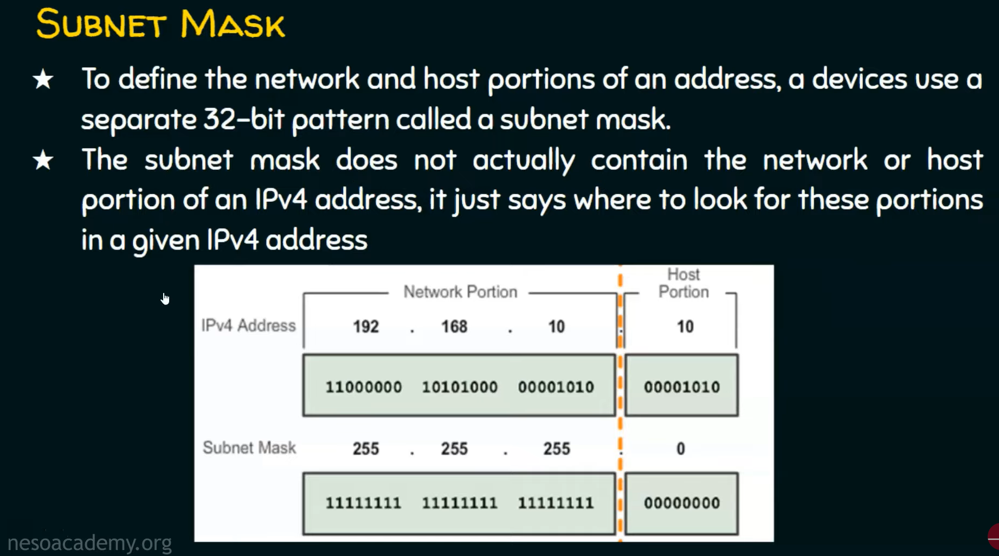

# IPv4 Address

An IPv4 address is 32-bit address that uniquely and universally defined the connection of a device.

Two devices on the internet can never have the same address at the same time.

The address space of IPv4 is 2^32 or (more than 4 billion).

## Notation

- **Binary Notation**: 01110101.10010101.00011101.00000010
- **Dotted-Decimal Notation**: 127.149.29.2

>### A.B.C.D (Only 4 octets)
>
>### 0<= A.B.C.D <= 255
>
>### 0.0.0.0 to 255.255.255.255

---

## Classes of IPv4 Address:

- *IP address* says what's the identity of a device in the network.
- *Subnet mask* says who are all our neighbors in the network.

## Subnet Mask

## Different ways of transmission in IPv4:

In an IPv4 network, the hosts can communicate one of three different ways:

- **Unicast Transmission**: the process of sending a packet from one host to an individual host.
  .png)
- **Broadcast Transmission**: The process of sending a packet from one host to all hosts in the network.
  .png)
-  **Multicast Transmission**: The process of sending a packet from one host to a selected group of hosts, possibly in different networks.

---

## Private IP Addresses

>Hosts that do not require access to to the internet can use private address 
>
>10.0.0.0 to 10.255.255.255 (10.0.0.0/8)
>
>172.16.0.0 to 172.31.255.255 (172.16.0.0/12)

Computers not connected to the internet, such as factory machines that communicate only with each other via TCP/IP, need not have globally unique IP addresses. Today, such private networks are widely used and typically connect to the internet with network address translation (NAT), when needed.

---

## Classless Addressing

Formal name is Classless Inter-Domain Routing (CIDR).

Created a new set of standards allowed service providers to allocate IPv4 addresses on any address bit boundary instead of only by a class A, B, or C address.

Classless addressing is possible with the help of subnetting.

.png)

### Valid Subnet Masks

