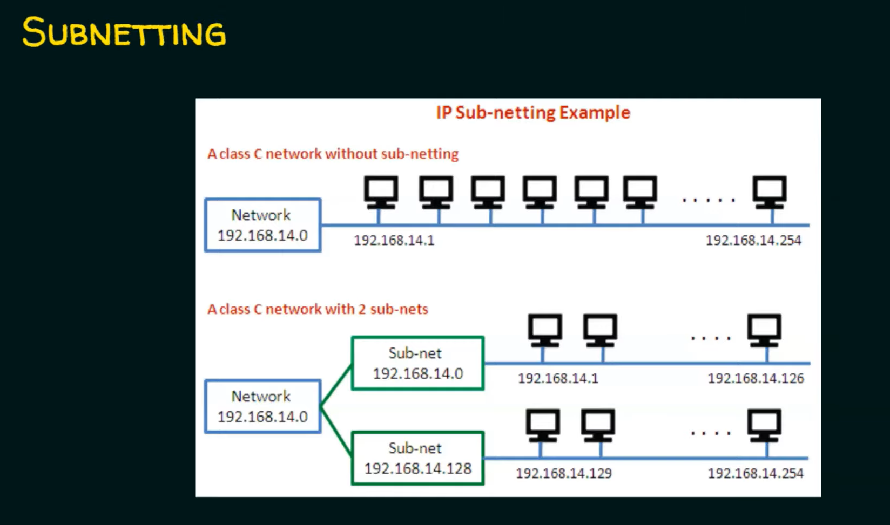
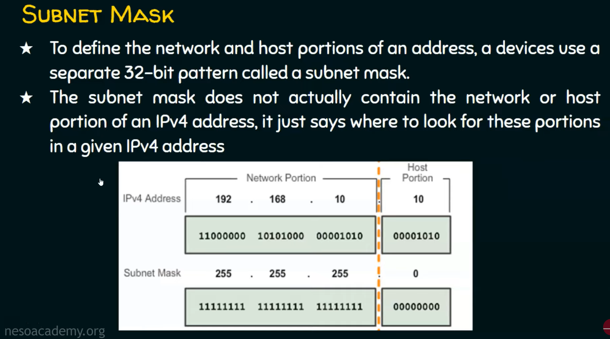

# Subnetting

> Subnetting is a process of dividing a larger IP network into smaller, more manageable subnetworks or subnets. It helps to efficiently allocate and manage IP addresses and improve network performance and security.

Here why we are not able to use 127 because in any subnetwork:

- The first IP address represents the network address.
- The last IP address represents the broadcast address.

 So in the first subnet (192.168.14.0) the IP address of 192.168.14.127 represents the **broadcast address**. where as the nest subnetwork the IP address (192.168.14.128) represents the starting IP address (the address of subnetwork).

---

## Subnet Mask (Slash Notations)

.png)

To define the network and host portion of an address, a device use a separate 32-bit pattern called a subnet mask.

---

## Subnetting - 5Steps

1. Identify the class of the IP address and note the Default Subnet Mask.
2. Convert the Default Subnet Mask into Binary.
3. Note the number of hosts required per subnet and find the Subnet Generator (SG) and octet position.
4. Generate the new subnet mask.
5. Use the SG and generate the network ranges (subnets) in the appropriate octet position.

### HOW TO FIND THE NUMBER OF NETWORK

>2^n (Here, n indicated total number of bits borrowed from host)

### HOW TO FIND THE NUMBER OF IP ADDRESS ON EACH NETWORK

> 2^n (Here, n indicated total number of host bits)

### HOW TO FIND THE NUMBER OF HOSTS IN EACH NETWORK

> 2^n -2 (Here, n indicated total number of remaining host bits)