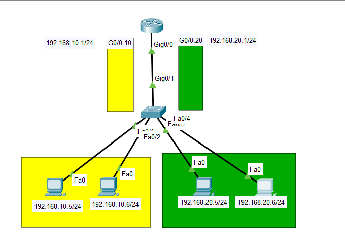
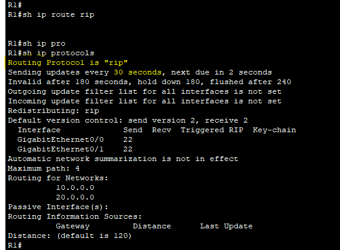

## Telnet 

Telnet (Teletype Network) is a protocol used to remotely access the CLI of a remote host.

Telnet has been largely replaced by SSH, which is more secure.

Telnet sends data in plain text. No encryption!

Telnet uses **TCP port 23**.

Telnet and SSH access are configured on the VTY lines.

### Configuration:

```sh
Switch(config)#enable secret root5
Switch(config)#username mohammad secret root5
```

If an enable password/secret isn't configured, you won't be able to access privilege exec mode when connecting via Telnet.

```sh
Switch(config)#access-list 1 permit host 192.168.2.1
```

Configure an ACL to limit which devices can connect to the VTY line.

```sh
Switch(config)#line vty 0 15
Switch(config-line)#login local
```

Telnet/SSH access is configured on the VTY lines. There are 16 lines available, so up to 16 users can be connected at once.

```sh
Switch(config-line)#transport input telnet
```

- *transport input telnet*  => This line allows only Telnet connections.
- *transport input ssh*  =>  allows only SSH connections.
- *transport input telnet ssh*  ==> allows both
- *transport input all*  ==> allows all connections.
- *transport input none*  ==>  allows no connections.

```sh
Switch(config-line)#access-class 1 in 
```

Apply the ACL to the VTY lines. 

- *access-class* applies an ACL to the VTY lines
- *ip access-group* applies an ACL to an interface.

---

## SSH (Secure Shell)

SSH (Secure Shell) was developed in 1995 to replace less secure protocols like Telnet.

- SSH uses **TCP port 22**.
- Provides security features such as data encryption and authentication.

### Steps:

1. Configure host name.
2. Configure DNS domain name.
3. Generate RSA key pairs.
4. Configure enable password, username/password.
5. Configure VTY lines.

- To enable and use SSH, you must generate an RSA public and private pair.

- The keys are used for data encryption / decryption, authentication, etc.

  ```sh
  Switch(config)#ip domain-name mohammad.com
  ```

  The *FQDN* of the device is used to name the RSA keys.

  FQDN = Fully Qualified Domain Name (host name + domain name).

  ```sh
  sw(config)#crypto key generate rsa
  The name for the keys will be: sw.mohammad.com
  Choose the size of the key modulus in the range of 360 to 4096 for your
    General Purpose Keys. Choosing a key modulus greater than 512 may take
    a few minutes.
  
  How many bits in the modulus [512]: 1024
  % Generating 1024 bit RSA keys, keys will be non-exportable...[OK]
  
  sw(config)#
  *Mar 1 0:3:4.870: %SSH-5-ENABLED: SSH 1.99 has been enabled
  sw(config)#
  ```

  Now we generated rsa keys (Note: we cannot generate rsa keys with default name of the switch).

### Configuration:

```sh
sw(config)#enable secret bnm543
sw(config)#username mohammad secret bnm543
sw(config)#access-list 1 permit host 192.168.2.1
```

```sh
sw(config)#line vty 0 15
```

Configure all VTY lines.

```sh
sw(config-line)#login local
```

Enable local user authentication. (You cannot use *login* for SSH, only *login local*).

```sh
sw(config-line)#transport input ssh
```

Best practice is limit VTY line connections to SSH only.

```sh
sw(config-line)#access-class 1 in
```

(Optional) Apply the ACL to restrict VTY line connections.

---

Change Switch mode:

```sh
Switch(config)#spanning-tree mode ?
  pvst        Per-Vlan spanning tree mode
  rapid-pvst  Per-Vlan rapid spanning tree mode
```

```sh
Switch(config)#spanning-tree mode rapid-pvst 
```

---

## PortFast & BPDU Guard

**PortFast**: Used for end-hosts to speed STP process. After PortFast is configured, the port immediately transitions from the blocking state to the forwarding state.

**BPDU Guard**: Used to avoid forming loop from an invalid PortFast configuration. If BPDU message is received, the port will be shut down. BPDU indicates that another switch is connected to the port.

to make it for all access ports: 

```sh
Switch(config)#spanning-tree portfast default 
```

or

```sh
Switch(config)#int fa0/3
Switch(config-if)#sw mode access 
Switch(config-if)#spanning-tree portfast
```

```sh
Switch(config-if)#spanning-tree bpduguard enable 
```

---

## Primary & Secondary Root

how to set primary root 

```sh
Switch(config)#spanning-tree vlan 1 root primary 
```

how to set secondary root

```sh
Switch(config)#spanning-tree vlan 1 root secondary 
```

---

# Dynamic Trunking Protocol

DTP is a Cisco proprietary protocol used for automatic negotiation of trunking (VLAN information) between switches in a network, allowing them to dynamically determine whether a link should operate as an access link or a trunk link.

This protocol has two modes:

1. Dynamic Auto.
2. Dynamic Desirable.


How to change switch mode:

```sh
Switch(config-if)#switchport mode dynamic desirable 
```

to see that:

```sh
Switch#sh int fa0/1 switchport 
```


Note: The port of switch by default is in **operation mode access** and in **switch mode dynamic auto**.

How to disable DTP:

before:


config:


after:


---

## Configuration:

set domain name:

```sh
Switch(config)#vtp domain test.com
```

set domain password:

```sh
Switch(config)#vtp password root5
```

change VTP mode:

```sh
Switch(config)#vtp mode server
or
Switch(config)#vtp mode client 
or
Switch(config)#vtp mode transparent 
```

to VTP status:

```sh
Switch#sh vtp status
```

---

# Cisco Discovery Protocol

CDP is a Cisco proprietary Layer 2 network protocol that allows Cisco devices to discover and share information about each each other. It operates at the Data Link Layer (Layer2) of the OSI model and helps in network management by providing details about neighboring devices, such as device type platform, and connected interface .

```sh
Switch#cdp enable
Switch#no cdp enable
```

Enable and disable cdp

```sh
Switch#sh cdp neighbors
```

Lists information about directly connected neighbors. Including their device ID, local interface and capabilities.

```sh
Switch#sh cdp neighbors detail 
```

Lists information about directly connected neighbors in details.

---

# Link Layer Discovery Protocol

LLDP the same as CDP but this protocol is not specific for Cisco devices it work with all devices.

```sh
Switch(config)#do sh lldp neighbor
% LLDP is not enabled
Switch(config)#lldp run
Switch(config)#do sh lldp neighbor
Capability codes:
    (R) Router, (B) Bridge, (T) Telephone, (C) DOCSIS Cable Device
    (W) WLAN Access Point, (P) Repeater, (S) Station, (O) Other
Device ID           Local Intf     Hold-time  Capability      Port ID

Total entries displayed: 0
Switch(config)#
```

---

## EtherChannel Configuration

There are two types of negotiation protocols are used for automatic link configuration between two switches.

1. ### PagP (Port Aggregation Protocol):

   - Developed by Cisco.
   - There are two modes to agree on PagP: **Desirable** and **Auto**.
   - In **Desirable** mode, the local switch sends an Etherachannel configuration request to the remote switch.
   - In **Auto**, the local switch waits for an Etherchannel configuration request from the opposite switch.

2. ## LACP (Link Aggregation Control Protocol):

   - Developed by IEEE 802.3ad standart.
   - There are two modes for switches to agree on LACP: **Active** and **Passive**.
   - In Active mode, the local switch sends an EtherChannel configuration request to the remote switch.
   - In Passive mode, the local switch waits for an EtherChannel configuration request from the opposite switch.

3. ## Static EtherChannel:

   - A protocol isn't used to determine if an Ethercannel should be vound.
   - Interfaces are statically cinfigured to from an Etherchannel


---

## Example using PagP:

This commands we will use it for the two switches.

```sh
Switch(config)#int range f0/1-2
Switch(config-if-range)#shutdown
Switch(config-if-range)#channel-group 1 mode desirable 
Switch(config-if-range)#no shutdown 
Switch(config)#int port-channel 1
Switch(config-if)#sw mode trunk
```


If we have another versions of switches:

```sh
Switch(config)#int range f0/1-2
Switch(config-if-range)#shutdown 
Switch(config-if-range)#channel-group 1 mode desirable 

Switch(config)#int range f0/1-2
Switch(config-if-range)#no shutdown 

Switch(config-if)#switchport trunk encapsulation dot1q 

Switch(config-if)#switchport trunk encapsulation dot1q 
```


---

## Example using LACP:

```sh
Switch(config)#int range f0/1-2
Switch(config-if-range)#shutdown 
Switch(config-if-range)#channel-group 1 mode active

Switch(config-if-range)#exit
Switch(config)#int por
Switch(config)#int port-channel 1
Switch(config-if)#sw mode trunk
```

---

## Example using Static:

```sh
s1(config)#int range f0/1-2
s1(config-if-range)#shutdown 

s1(config-if-range)#channel-group 1 mode on

s1(config-if-range)#exit
s1(config)#int range f0/1-2
s1(config-if-range)#no shutdown 

s1(config)#int port-channel 1
s1(config-if)#sw mode trunk
```


---

2. ## Router-on-a-Stick (ROAS)

   ## Steps:

   1. We configure switch and its VLANs and linking them with PCs.
   2. We put the port which linked with the router as **Trunk**.
   3. We create **Sub-Interfaces**:
      - create sub-interface
      - encapsulate it as dot1Q with VLAN
      - put IP address to it.

    



---

## DHCP Router

1. **Router Configure for fa0/0:**


2. **Router Configure for fa0/1:**


### Exclude some IP addresses:


- NOTE: we should always exclude default IP address.

**Now we will create the first and second DHCP pool:**


- NOTE: adding dns-server is optional.

## To see all info about DHCP:

```sh
DHCP_SVR#sh ip dhcp binding 

DHCP_SVR#sh ip dhcp pool
```


---


---

## RIPv1 Configuration


R0

```sh
Router# debug ip rip 
```

```sh
Router(config)# router rip
Router(config)# network 1.0.0.0
Router(config)# network 2.0.0.0
Router(config)# network 3.0.0.0
```

R1

```sh
Router(config)# network 5.0.0.0
Router(config)# network 6.0.0.0
```

---

## RIPv2 Configuration


First we have to enable rip:

R1

```sh
R1(config)#
R1(config)#router rip
R1(config-router)#version 2
R1(config-router)#
```

second I will prevent it from summarizing my networks (Router 1 connected networks).

```sh
R1(config-router)#no auto-summary 
```

Finally I have to make router (R1) to advertise his networks.

```sh
R1(config-router)#network 10.0.0.0
R1(config-router)#network 20.0.0.0
```

```sh
R1#sh ip protocols 
```



R2: 

```sh
R2(config)#
R2(config)#router rip
R2(config-router)#version 2
R2(config-router)#no auto-summary
R2(config-router)#network 20.0.0.0
R2(config-router)#network 30.0.0.0
R2(config-router)#
```

So now R1 and R2 become a neighbors so R1 can share networks with R2 and vice versa.

R3:

```sh
R3(config)#
R3(config)#router rip
R3(config-router)#version 2
R3(config-router)#network 30.0.0.0
R3(config-router)#network 40.0.0.0
R3(config-router)#
```


---

## EIGRP Configuration


R1:

```sh
R1(config)#router eigrp 50
R1(config-router)#network 200.1.1.0
R1(config-router)#network 200.1.1.172
R1(config-router)#network 200.1.1.180
```

R2:

```sh
R2(config)#router eigrp 50
R2(config-router)#network 200.1.1.172
R2(config-router)#
%DUAL-5-NBRCHANGE: IP-EIGRP 50: Neighbor 200.1.1.173 (GigabitEthernet0/0) is up: new adjacency

R2(config-router)#network 200.1.1.128
R2(config-router)#network 200.1.1.168
```

R3:

```sh
R3(config)#router eigrp 50
%DUAL-5-NBRCHANGE: IP-EIGRP 50: Neighbor 200.1.1.169 (GigabitEthernet0/0) is up: new adjacency

R3(config-router)#network 200.1.1.184
R3(config-router)#network 200.1.1.160
```

R4:

```sh
R4(config)#router eigrp 50
R4(config-router)#network 10.1.1.0
R4(config-router)#network 200.1.1.184
R4(config-router)#
%DUAL-5-NBRCHANGE: IP-EIGRP 50: Neighbor 200.1.1.185 (GigabitEthernet0/0) is up: new adjacency

%DUAL-5-NBRCHANGE: IP-EIGRP 50: Neighbor 200.1.1.181 (GigabitEthernet0/1) is up: new adjacency

R4(config-router)#network 200.1.1.180
```

To see EIGRP routes:

```sh
R1#sh ip eigrp int
```

```sh
R1#sh ip eigrp neighbors 
```

```sh
R1#sh ip eigrp topology
```

---

## Redistribution EIGRP with RIPv4


```sh
Router(config)#router eigrp 34
Router(config-router)#redistribute connected 
Router(config-router)#redistribute rip 
Router(config-router)#redistribute rip metric 10000 0 255 1 1500
Router(config-router)#network 4.4.4.0 0.0.0.3
```

```sh
Router(config)#router rip
Router(config-router)#version 2
Router(config-router)#redistribute eigrp 34 metric 1
Router(config-router)#network 4.0.0.0
```

---

## OSPF Configuration

R1:

```sh
Router(config)#router ospf 5
Router(config-router)#network 200.1.1.0 0.0.0.127 area 0
Router(config-router)#network 200.1.1.172 0.0.0.3 area 0
Router(config-router)#network 200.1.1.176 0.0.0.3 area 0
```

R2:

```sh
Router(config)#router ospf 6
Router(config-router)#network 200.1.1.128 0.0.0.31 area 0
Router(config-router)#network 200.1.1.180 0.0.0.3 area 0
Router(config-router)#network 200.1.1.172 0.0.0.3 area 0
Router(config-router)#network 200.1.1.168 0.0.0.3 area 0
```

R3:

```sh
Router(config)#router ospf 7
Router(config-router)#network 200.1.1.176 0.0.0.3 area 0
Router(config-router)#network 200.1.1.184 0.0.0.3 area 0
Router(config-router)#network 200.1.1.160 0.0.0.7 area 0
```

ABR-100 Router:

```sh
Router(config)#router ospf 5
Router(config-router)#network 200.1.1.180 0.0.0.3 area 0
Router(config-router)#network 205.5.5.128 0.0.0.3 area 100
```

R5:

```sh
Router(config)#router ospf 4
Router(config-router)#network 205.5.5.128 0.0.0.3 area 100
Router(config-router)#network 205.5.5.0 0.0.0.127 area 100
```

ABR-200 Router:

```sh
Router(config)#router ospf 8
Router(config-router)#network 200.1.1.184 0.0.0.3 area 0
Router(config-router)#network 177.7.4.0 0.0.0.3 area 200
```

R6:

```sh
Router(config)#router ospf 5
Router(config-router)#network 177.7.4.0 0.0.0.3 area 200
Router(config-router)#network 177.7.0.0 0.0.3.255 area 200
```

To see all what we did:

```sh
Router#sh ip ospf neighbor
```

```sh
Router#sh ip ospf interface brief
```

To delete all OSPF config in the router:

```sh
Router#clear ip ospf database 
```

---

# Access Control List


## ACL Configuration

```sh
R2(config)#access-list 10 remark ACL_TO_PINK_LAN
```

remark is not mandatory .. but here we use it just to add comment

To permit PC-C to to connect with this LAN:

```sh
R2(config)#access-list 10 permit host 192.168.2.50
```

Now we want to permit the first half of yellow network: so we will subnet this network and then writing the command to permit the first half of this network:

```sh
R2(config)#access-list 10 permit 192.168.1.0 0.0.0.127
```

Now we want to permit all network of blue LAN:

```sh
R2(config)#access-list 10 permit 172.16.1.0 0.0.0.255
```

To see our access list:

```sh
R2#sh access-lists 10
```

### Now we have to configure interfaces (IN - OUT):

```sh
R2(config)#int g0/1
R2(config-if)#ip access-group 10 out
```

### To allow all networks:

```sh
R2(config)#access-list 20 permit any
```

### To deny a network:

```sh
R2(config)#access-list 20 deny 192.168.1.0 0.0.0.255
```

---

## Configuration of Named Standard ACL


```sh
R1(config)#ip access-list standard ADMIN_VTY
```

Here "ADMIN_VTY" is the name

Now permit PC-C to enter to the router:

```sh
R1(config-std-nacl)#permit host 192.168.2.50

R1(config-std-nacl)#ex
R1(config)#
R1(config)#line vty 0 4
R1(config-line)#access-class ADMIN_VTY in
```

